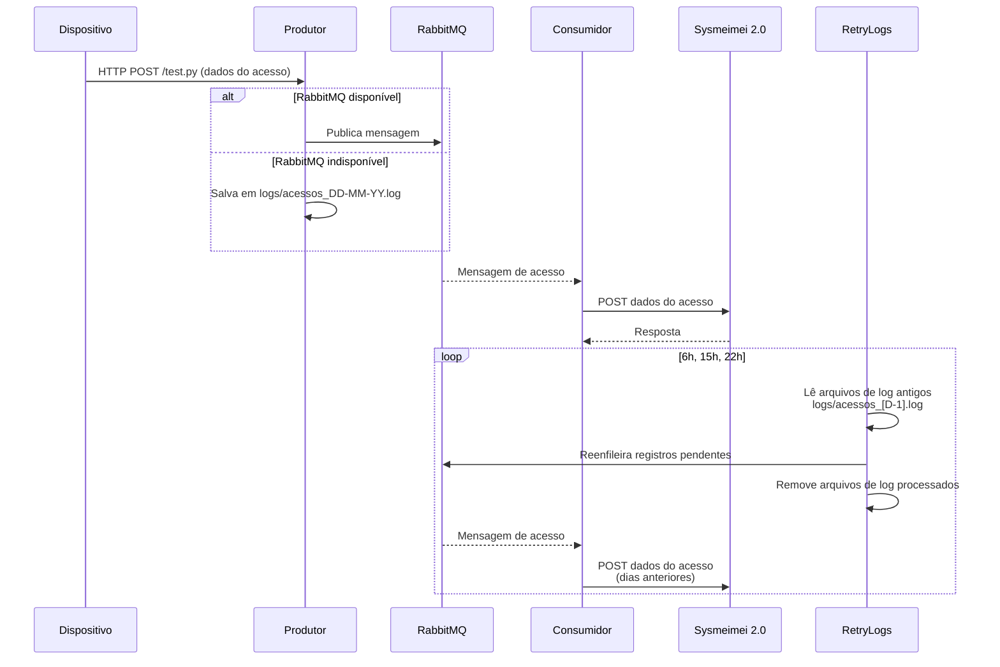

# Controle de Acesso - Lar Meimei

Este projeto implementa um sistema de controle de acessos baseado em microserviços, utilizando Python, Docker e RabbitMQ. Ele é composto por três serviços principais:

- **Produtor:** Recebe requisições HTTP de dispositivos de leitura de acesso, publica eventos em uma fila RabbitMQ ou salva localmente em caso de falha.
- **Consumidor:** Consome eventos da fila RabbitMQ e envia os dados para uma API externa.
- **Retry-Logs:** Periodicamente, reenfileira registros de presença salvos em arquivos de log locais para o RabbitMQ, caso tenham ficado pendentes por indisponibilidade do serviço.

---

## Estrutura do Projeto

```
controle-acesso/
├── consumidor/
│   ├── Dockerfile
│   ├── requirements.txt
│   └── sysmeimei-ac-consumer.py
├── produtor/
│   ├── Dockerfile
│   ├── requirements.txt
│   └── sysmeimei-ac-server.py
├── retry/
│   ├── Dockerfile
│   ├── requirements.txt
│   └── retry-logs.py
├── docker-compose.yml
```

---

## Como funciona

1. **Dispositivo de acesso** faz uma requisição HTTP POST para o serviço **produtor**.
2. O **produtor** tenta publicar a mensagem na fila do **RabbitMQ**.
   - Se não conseguir, salva o evento em um arquivo de log local. para ser retentado no dia seguinte.
3. O **consumidor** lê as mensagens da fila e envia para a API do Lar Meimei.
4. O **retry-logs** roda automaticamente todos os dias às 6h, 15h e 22h, reenfileirando registros de presença salvos em arquivos de log de dias anteriores para o RabbitMQ.

---

## Como rodar

1. Certifique-se de ter Docker e Docker Compose instalados.
2. Execute:
   ```sh
   docker compose up --build
   ```
3. O serviço produtor ficará disponível na porta 8000 do host.

---

## Exemplo de requisição

```http
POST http://<IP_DO_HOST>:8000/test.py
Content-Type: application/json

{
  "perfil": "usuario",
  "area": "SF - Sócio Familiar",
  "nome": "Maria"
}
```

---

## Logs

Se o RabbitMQ estiver indisponível, os acessos serão salvos em arquivos `logs/acessos_DD-MM-YY.log` no host.  
O serviço **retry-logs** processa todos os arquivos de log de dias anteriores, reenfileirando os registros para o RabbitMQ e removendo os arquivos após o sucesso.

---

## Diagrama de Sequência



---

## Variáveis de ambiente importantes

- `RABBITMQ_HOST`: Host do RabbitMQ (use `rabbitmq` no docker-compose)
- `RABBITMQ_PORT`: Porta do RabbitMQ (padrão: 5672)
- `LOG_DIR`: Diretório dos arquivos de log (padrão: logs)

---

## Observações

- O serviço produtor deve ser acessado pelo IP do host na rede local, não pelo IP do container.
- Os arquivos de log são persistidos no host via volume Docker.
- O serviço retry-logs garante que nenhum acesso será perdido mesmo com RabbitMQ fora.
- Mantenha os arquivos `requirements.txt` atualizados em cada serviço para garantir o correto funcionamento dos containers.

---

## docker-compose.yml (exemplo)

```yaml
version: "3.9"

services:
  produtor:
    build: ./produtor
    container_name: produtor
    depends_on:
      - rabbitmq
    environment:
      - RABBITMQ_HOST=rabbitmq
      - RABBITMQ_PORT=5672
    ports:
      - "8000:8000"
    volumes:
      - ./produtor/logs:/usr/src/app/logs
    command: python -u sysmeimei-ac-server.py

  consumidor:
    build: ./consumidor
    container_name: consumidor
    depends_on:
      - rabbitmq
    environment:
      - RABBITMQ_HOST=rabbitmq
      - RABBITMQ_PORT=5672
    command: python -u sysmeimei-ac-consumer.py

  rabbitmq:
    image: rabbitmq:3-management
    container_name: rabbitmq_server
    ports:
      - "5672:5672"     # Porta para comunicação AMQP
      - "15672:15672"   # Porta para o painel de administração web
    volumes:
      - ./rabbitmq_data:/var/lib/rabbitmq
    environment:
      - RABBITMQ_DEFAULT_USER=admin
      - RABBITMQ_DEFAULT_PASS=admin

  retry-logs:
    build: ./retry
    container_name: retry-logs
    depends_on:
      - rabbitmq
    volumes:
      - ./produtor/logs:/usr/src/app/logs
    environment:
      - RABBITMQ_HOST=rabbitmq
      - RABBITMQ_PORT=5672
      - LOG_DIR=logs
    command: python -u retry
```